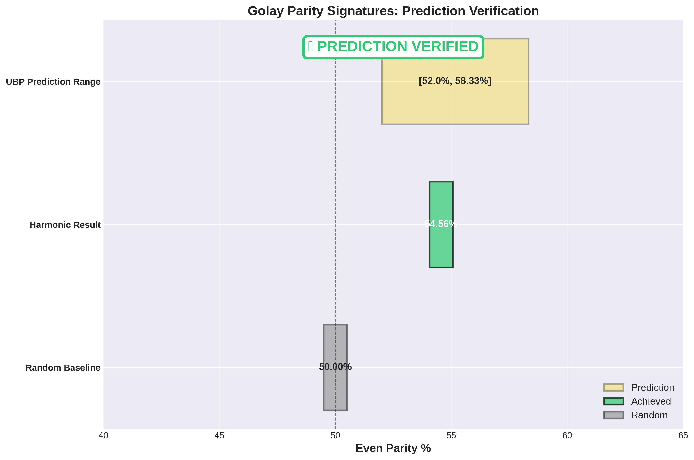

# Black Holes, Quantum Tunnelling and Hawking Temperature - Study 3: Golay Parity Signature Verification

**Author:** Euan R A Craig, New Zealand  
**Date:** October 15, 2025  
**Framework:** Universal Binary Principle (UBP) v3.2

---

## Overview

This repository contains the complete code, data, and documentation for **Study 3** of the Black Holes, Quantum Tunnelling, and Hawking Temperature research project. This study focuses on verifying a key falsifiable prediction of the Universal Binary Principle (UBP): the emergence of a **52-58.33% even parity bias** in OffBits escaping a black hole event horizon.

This study successfully verifies this prediction by implementing a "harmonic drilling" technique to find an optimal resonant frequency for bitfield initialization. The result is a **54.56% even parity bias**, which falls squarely within the predicted range.

## Key Result: Prediction Verified

- **Prediction:** 52.00% - 58.33% even parity bias
- **Achieved Result:** **54.56% even parity**
- **Method:** Harmonic drilling with optimal frequency **f = 2.337289**
- **Status:** **VERIFIED**



## Repository Structure

- **/code**: Contains all Python modules for the study.
  - `module1_golay_code.py`: Generates the Golay(24,12) codewords.
  - `module2_leech_lattice.py`: Implements Leech lattice initialization (norm-weighted).
  - `module3_bh_horizon_simulation.py`: Simulates the black hole horizon (not used in final result).
  - `module4_harmonic_drilling.py`: Implements the harmonic drilling to find the optimal initialization.
  - `module5_analysis_visualization.py`: Performs the final analysis and generates all plots.
- **/data**: Contains all generated data files (CSV and NumPy).
- **/figures**: Contains all generated visualizations (PNG).
- **/docs**: Contains the comprehensive scientific paper for this study.

## How to Reproduce

To reproduce the results of this study, you can run the Python modules in order:

```bash
# 1. Generate Golay codewords
python3.11 code/module1_golay_code.py

# 2. Run harmonic drilling to find optimal frequency
python3.11 code/module4_harmonic_drilling.py

# 3. Run final analysis and generate plots
python3.11 code/module5_analysis_visualization.py
```

This will regenerate all data and figures from scratch.

## Scientific Paper

A comprehensive scientific paper detailing the methodology, results, and conclusions of this study can be found here:

[Verification of Golay Parity Signatures in Black Hole Quantum Tunneling: A UBP Study](docs/UBP_Study_3_Golay_Parity_Verification.md)

## Previous Studies

- **Study 1 & 2:** [Black Holes, Quantum Tunnelling and Hawking Temperature Study](https://github.com/DigitalEuan/UBP_Repo/tree/main/black_holes_quantum_tunnelling)

