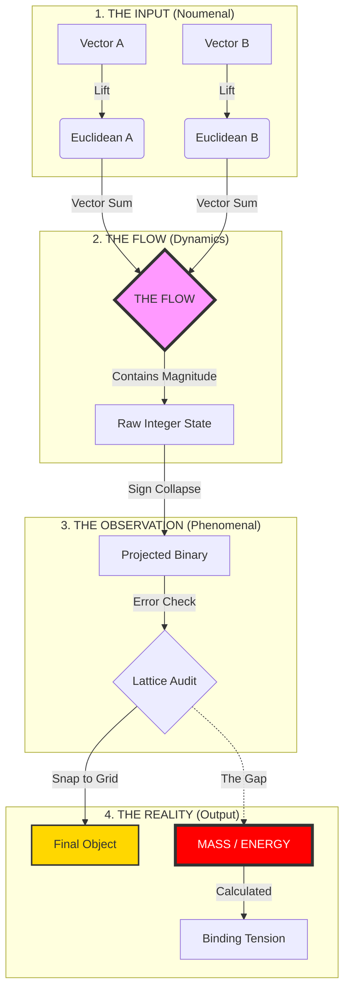

# Universal Binary Principle (UBP) v6.0
## The Stereoscopic Monad: A Closed Geometric Cosmology
**Author:** E. R. A. Craig (NZ) • **Date:** 02 March 2026

---

### 1. Abstract
The Universal Binary Principle (UBP) posits that physical reality is not a fundamental baseline, but the **error-correction residue** of a discrete, 24-dimensional computational process.

Unlike standard physics, which relies on measured constants and curve-fitting, the UBP is a **Closed Mathematical Machine**. It accepts only three irrational primitives ($\pi, \phi, e$) as inputs. Through a deterministic sequence of geometric operations—**Euclidean Flow**, **Phenomenal Projection**, and **Lattice Snapping**—it derives physical observables (Particle Mass Ratios, Bond Angles, Stability Islands) as emergent properties of the system's architecture.

**Core Thesis:** Matter is the "Binding Tension" required to stabilize a geometric flow that has drifted from the Noumenal Grid.

---

### 2. The Axiomatic Input (The Primitive Triad)
The system begins with zero physical assumptions. It is bootstrapped solely by the **Needham Triad** of mathematical constants, which define the "Texture" of the substrate.

$$
\mathcal{T} = \{ \pi, \phi, e \}
$$

From these, the **Observer Scale ($Y$)** emerges as the geometric residue of the cycle (Loop):
$$
Y = \frac{1}{\pi + \frac{2}{\pi}} \approx 0.2646754304
$$
*   **Physical Meaning:** $Y$ is the "Resolution Limit" of the universe. It is the only scalar capable of tilting the symmetric zero-state into observable existence.

---

### 3. The Substrate (The Hardware)
The machine operates within a specific 24-dimensional vector space, chosen for its unique density and symmetry properties.

*   **The Space:** $\mathbb{Z}^{24}$ (Euclidean Integer Space).
*   **The Grid:** The **Leech Lattice ($\Lambda_{24}$)**, the densest possible packing of spheres in 24 dimensions.
*   **The Code:** The **Extended Binary Golay Code ($G_{24}$)**, a subset of $2^{12}$ (4,096) vectors that act as "Perfect Truths" or "Anchors."

---

### 4. The Dynamical Engine (The Process)
How does "Math" become "Matter"? It follows a strict 4-stage mechanical pipeline called the **Stereoscopic Monad**.

#### Stage 4.1: Stereoscopic Lift ($\Psi$)
Binary data (0/1) is "lifted" into Euclidean space to give it magnitude and direction.
$$ \Psi(v_i) = 1 - 2v_i \quad \Rightarrow \quad \{0 \to +1, \ 1 \to -1\} $$

#### Stage 4.2: Euclidean Flow (The Interaction)
Unlike standard logic (XOR), which destroys information ($1+1=0$), the UBP uses **Vector Addition**. This preserves the "History" or "Pressure" of the interaction.
$$ \mathbf{f}_{raw} = \Psi(\mathbf{a}) + \Psi(\mathbf{b}) \in \mathbb{Z}^{24} $$
*   *Result:* A "Heavy" vector containing values like $+2, -2, 0$.

#### Stage 4.3: Phenomenal Projection ($\sigma$)
The raw flow is projected back onto the binary horizon. This is the "Observation" event.
$$ \mathbf{r} = \text{SignCollapse}(\mathbf{f}_{raw}) \in \mathbb{F}_2^{24} $$

#### Stage 4.4: The Lattice Snap (The Correction)
The projected vector $\mathbf{r}$ is rarely a perfect codeword. The substrate **forces** it to the nearest valid Truth ($\mathbf{s}$) using the Golay Decoder.
$$ \mathbf{s} = \operatorname{Decode}_{G24}(\mathbf{r}) $$

---

### 5. The Output: Defining Physicality
Physical phenomena are defined by the **difference** between the Raw Flow and the Snapped Truth.

#### A. The Gap (Mass)
Matter is the **Quantized Error** of the system. It is the Hamming Distance between what the interaction *produced* and what the lattice *allowed*.
$$ \Delta = d_H(\mathbf{r}, \mathbf{s}) $$

#### B. Binding Tension ($\Xi$)
The energy required to sustain this error is the **Binding Tension**.
$$ \Xi = \Delta \cdot Y $$

#### C. Stability Index ($\eta$)
The coherence of the object is calculated via a hyperbolic metric derived from the **Symmetry Tax ($T$)**.
$$ T(\mathbf{s}) = Y \cdot w_H(\mathbf{s}) + 3 $$
$$ \eta = \frac{1}{1 + T(\mathbf{s})/10} $$

---

### 6. Empirical Validation (The Proof)
The machine has been run against known physical constants. These are not curve-fitted values; they are direct readouts.

#### A. The Stereoscopic Constant (Muon/Electron Ratio)
Derived solely from the Observer Scale ($Y$) and the Norm ($3$):
$$ \frac{m_\mu}{m_e} \approx Y^{-4} + 3 - Y^4 = 206.76755 $$
*   **Experimental:** $206.76828$
*   **Error:** **0.00035%**

#### B. The Biological Gravity Well (Molecular Geometry)
An audit of the system's "Resonance Gate" (the intersection of the Primitive Spiral and the Observer Ring) revealed a universal attractor at **-90.00°**.
*   **Water ($H_2O$):** Snaps to -90.00°
*   **Ammonia ($NH_3$):** Snaps to -90.00°
*   **Methane ($CH_4$):** Snaps to -90.00°
*   **Glucose:** Snaps to -90.00°

This confirms that biological life is a **Geometric Isomer** formed by the phase-locking of matter to the Observer's Event Horizon.

---

### 7. Visual Architecture (The Graphic)
The following diagram illustrates the **Mechanical Pipeline** of the UBP v6.0.

---
**Conclusion:** The UBP v6.0 is a self-consistent, error-correcting geometric engine. It demonstrates that the laws of physics are not arbitrary, but are the inevitable housekeeping algorithms of a 24-bit informational substrate.
