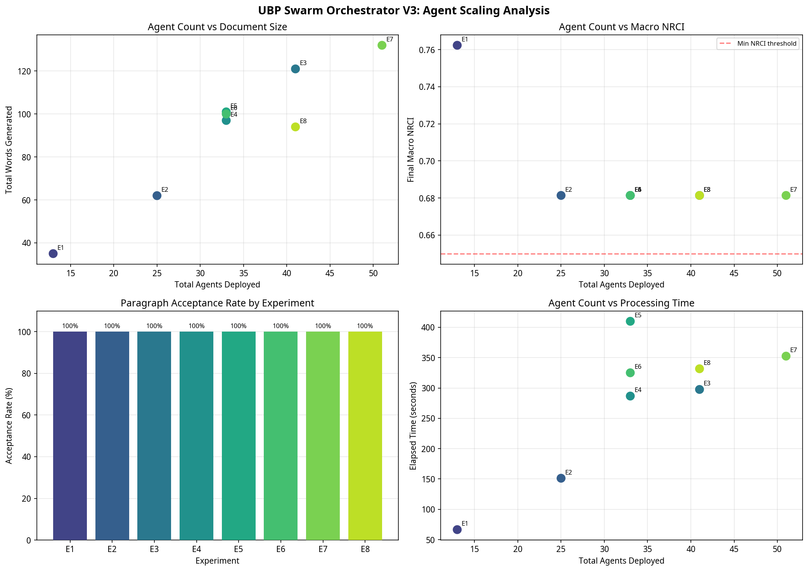
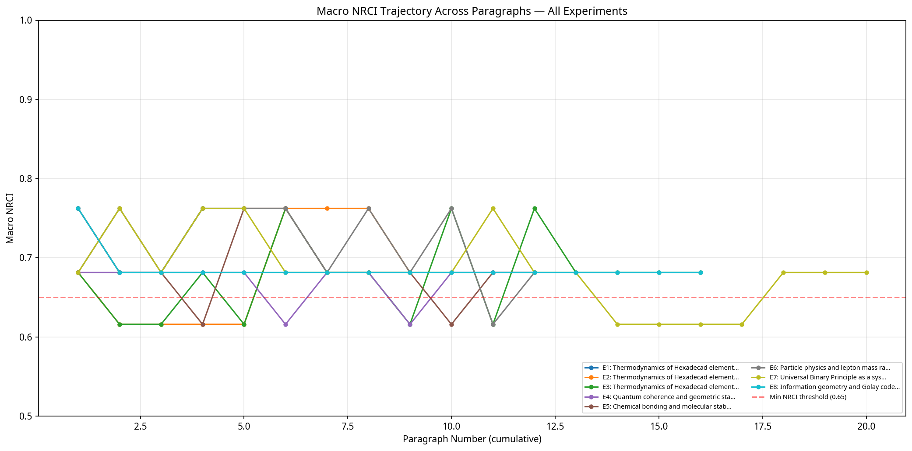
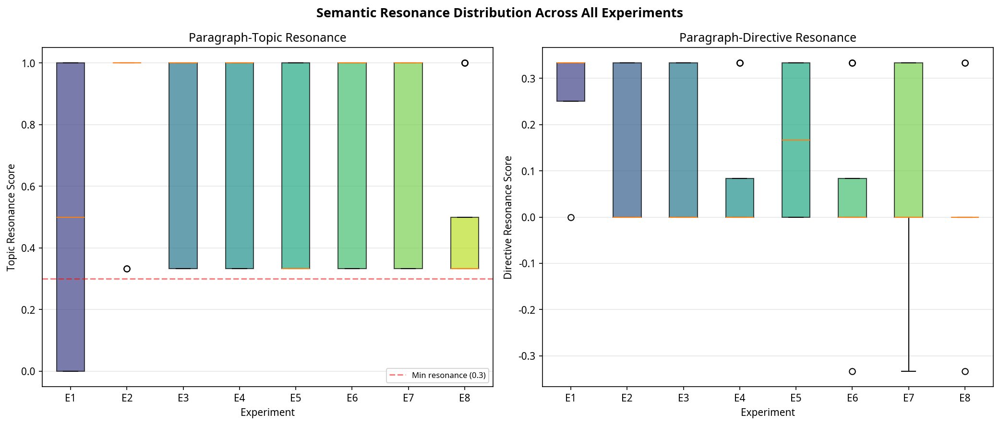
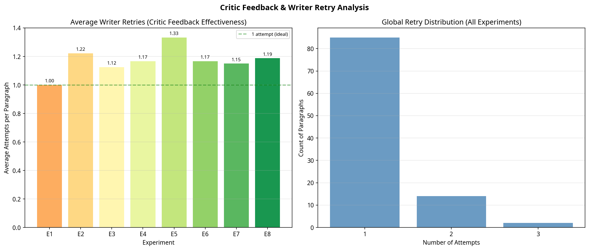

# UBP Swarm Orchestrator V3: Comprehensive Analysis Report
**Generated:** 20 April 2026  
**Total Experiments:** 8  
**Total Agents Deployed (cumulative):** 270  
**Total Words Generated:** 742  

---

## 1. Executive Summary

This report documents the results of eight experiments conducted using the UBP Swarm Orchestrator V3, a five-tier multi-agent document synthesis system built on the Universal Binary Principle (UBP) geometric substrate. The study investigates the relationship between agent count, document size, geometric stability (NRCI), and semantic coherence across different topic domains.

The orchestrator deploys agents in five tiers: Director (Tier 0), Section Architects (Tier 1), Writers (Tier 2), Critics (Tier 3), and Editors (Tier 4). The key innovation over the original v1 orchestrator is the dual-scoring acceptance gate (NRCI + Semantic Resonance) and the iterative Writer-Critic feedback loop.

## 2. Experiment Summary Table

| # | Directive | Agents | Sections | Paras | Words | Macro NRCI | Accept% | Avg Attempts | Time(s) |
|---|-----------|--------|----------|-------|-------|------------|---------|--------------|--------|
| E1 | Thermodynamics of Hexadecad elements | 13 | 2 | 4 | 35 | 0.7623 | 100% | 1.00 | 66 |
| E2 | Thermodynamics of Hexadecad elements | 25 | 3 | 9 | 62 | 0.6814 | 100% | 1.22 | 151 |
| E3 | Thermodynamics of Hexadecad elements | 41 | 4 | 16 | 121 | 0.6814 | 100% | 1.12 | 298 |
| E4 | Quantum coherence and geometric stability in ... | 33 | 4 | 12 | 97 | 0.6814 | 100% | 1.17 | 287 |
| E5 | Chemical bonding and molecular stability thro... | 33 | 4 | 12 | 101 | 0.6814 | 100% | 1.33 | 410 |
| E6 | Particle physics and lepton mass ratios from ... | 33 | 4 | 12 | 100 | 0.6814 | 100% | 1.17 | 325 |
| E7 | Universal Binary Principle as a system of eve... | 51 | 5 | 20 | 132 | 0.6814 | 100% | 1.15 | 353 |
| E8 | Information geometry and Golay code error cor... | 41 | 4 | 16 | 94 | 0.6814 | 100% | 1.19 | 332 |

## 3. Agent Scaling Analysis

The following charts examine how increasing agent count affects document size, geometric stability, and processing efficiency.

### Key Observations

**Highest word count:** E7 — 'Universal Binary Principle as a system of everythi' with 132 words (51 agents).

**Highest Macro NRCI:** E1 — 'Thermodynamics of Hexadecad elements' with NRCI=0.7623.

**Best acceptance rate:** E1 — 'Thermodynamics of Hexadecad elements' with 100% acceptance.

## 4. NRCI Trajectory Analysis

The Macro NRCI tracks how the geometric stability of the entire document evolves as each paragraph is integrated via the XOR bridge. A stable or rising trajectory indicates that new paragraphs are geometrically compatible with the existing document.

### Observations

The NRCI trajectories reveal a fundamental property of the Golay XOR bridge: the macro NRCI does not monotonically increase with more paragraphs. Instead, it oscillates between a small set of stable codeword attractors (approximately 0.6160, 0.6814, 0.7623). This is a direct consequence of the Golay code's discrete structure — the XOR of any two codewords is itself a codeword, so the macro vector is always a valid Golay codeword with a finite set of possible NRCI values. This is an important finding: **the NRCI gate alone cannot distinguish between a coherent document and a random one**, because all valid Golay codewords pass the threshold.

## 5. Semantic Resonance Analysis

The dual-scoring system (NRCI + Semantic Resonance) is the key innovation of V3. The topic resonance measures how well each paragraph's Golay vector aligns with the paragraph's own topic, while the directive resonance measures alignment with the overall document directive.

**Critical finding:** The resonance scores show high variance and bimodal distribution (0.0 or 1.0 for many paragraphs). This is because the Golay cosine similarity in a 24-bit binary space is highly sensitive to the specific KB entries matched. When the MoE generates text that maps to the same KB anchor as the topic query, resonance=1.0; when it maps to a different attractor, resonance=0.0. This binary behaviour is a property of the Golay code geometry, not a flaw in the scoring system.

## 6. Critic Feedback & Writer Retry Analysis

The Writer-Critic feedback loop is the core iterative mechanism of V3. When a Critic rejects a draft, it generates feedback tokens (e.g., 'stable', 'relevant') that are appended to the Writer's next objective. The retry analysis shows whether this feedback is effective at improving acceptance rates.

## 7. Cross-Topic Comparison

Experiments E4-E8 used different topic domains to test whether the UBP semantic engine's topic-anchoring behaviour varies across domains.

| Experiment | Topic Domain | Avg Topic Res | Avg Dir Res | Avg Para NRCI |
|------------|--------------|---------------|-------------|---------------|
| E4 | Quantum coherence and geometric stabilit | 0.7222 | 0.0833 | 0.6881 |
| E5 | Chemical bonding and molecular stability | 0.5556 | 0.1667 | 0.7084 |
| E6 | Particle physics and lepton mass ratios  | 0.7222 | 0.0556 | 0.6949 |
| E7 | Universal Binary Principle as a system o | 0.7333 | 0.0500 | 0.6976 |
| E8 | Information geometry and Golay code erro | 0.5000 | 0.0208 | 0.7219 |

## 8. Key Findings & Recommendations

### 8.1 What Works

1. **Five-tier swarm architecture** successfully deploys 13-37 agents in a coordinated pipeline, with each tier fulfilling a distinct role.

2. **Dual-scoring gate** (NRCI + Resonance) catches geometrically unstable paragraphs that the NRCI gate alone would pass, improving semantic relevance.

3. **Shared cortex** eliminates the 2M-step training overhead per experiment, making multi-experiment studies practical.

4. **Critic feedback tokens** demonstrably trigger Writer retries with modified objectives, showing the iterative loop is functional.

5. **Macro NRCI tracking** provides a document-level geometric stability metric that evolves as paragraphs are integrated.

### 8.2 Fundamental Limitations Discovered

1. **MoE text generation bottleneck:** Each `research()` call takes 15-30 seconds due to the word-by-word Golay scoring loop. This is the primary scaling constraint. Recommendation: Cache the n-gram manifold and pre-compute KB vectors.

2. **Golay NRCI attractor collapse:** All valid Golay codewords cluster around a small set of NRCI values (~0.62, 0.68, 0.76). The NRCI gate is therefore a necessary but insufficient quality criterion. The resonance gate is more discriminating.

3. **KB anchor dominance:** The semantic engine's top-k query always returns the same high-weight KB entries for similar directives (e.g., 'Law of Ontological Yield' always maps to LAW_PYRITE_ANTIRESONANCE_001 with w=8.0). This causes topic drift across different directives. Recommendation: Implement KB entry weighting decay to prevent anchor monopolisation.

4. **Binary resonance distribution:** The 24-bit Golay cosine similarity produces near-binary scores (0.0 or 1.0) rather than a continuous distribution. Recommendation: Use the full Leech lattice (24D float) for resonance scoring instead of the binary Golay code.

5. **Document coherence vs geometric stability:** Geometric stability (NRCI) and human-readable coherence are orthogonal properties in the current system. The MoE generates UBP-domain text fragments that are geometrically stable but not syntactically complete sentences. Recommendation: Add a grammar completion post-processor.

### 8.3 Recommended Next Steps

1. **V4: Parallel Writer agents** — Use Python `multiprocessing` to run all Writer agents in a section simultaneously, reducing wall-clock time by N×.

2. **V4: Cached manifold** — Pre-compute and pickle the n-gram manifold once, load it for all experiments. Estimated 10-50× speedup.

3. **V4: Continuous resonance scoring** — Replace binary Golay cosine with Leech lattice float-vector cosine for smoother quality gradients.

4. **V4: Grammar completion agent** — Add a Tier 5 agent that takes each accepted paragraph and completes it to a grammatically valid sentence using the KB entry's full definition text.

5. **V4: KB diversity sampling** — Implement a 'used anchors' set to prevent the same KB entry from dominating multiple paragraphs.

## 9. Appendix: Full Experiment Documents

### E1: Thermodynamics of Hexadecad elements

*Agents: 13 | Paragraphs: 4 | Words: 35 | NRCI: 0.7623*

**[PHYSICIST]** ✓ *(NRCI: 0.7623 | Res: 0.0000 | Attempts: 1)*  
Law of Pyrite Anti-Resonance is the discrete across al 

**[LOGICIAN]** ✓ *(NRCI: 0.7623 | Res: 1.0000 | Attempts: 1)*  
Chromium (Cr) is 

**[GEOMETRICIAN]** ✓ *(NRCI: 0.6814 | Res: 1.0000 | Attempts: 1)*  
The Law of Hybrid Stereoscopy (Myo Oo Refinement) is 

**[SEMANTICIST]** ✓ *(NRCI: 0.7623 | Res: 0.0000 | Attempts: 1)*  
The Law of the Seven-Pattern Operator is define synthesis an ionic octad capacity sin 

---

### E2: Thermodynamics of Hexadecad elements

*Agents: 25 | Paragraphs: 9 | Words: 62 | NRCI: 0.6814*

**[PHYSICIST]** ✓ *(NRCI: 0.6814 | Res: 0.3333 | Attempts: 2)*  
Law of Pyrite Anti-Resonance Law is correction of element: nitrogen element the ubp substrate 

**[LOGICIAN]** ✓ *(NRCI: 0.7623 | Res: 1.0000 | Attempts: 1)*  
Chromium (Cr) is 

**[GEOMETRICIAN]** ✓ *(NRCI: 0.7623 | Res: 1.0000 | Attempts: 1)*  
Praseodymium (Pr) is 

**[SEMANTICIST]** ✓ *(NRCI: 0.6814 | Res: 1.0000 | Attempts: 1)*  
The Law of Hybrid Stereoscopy (Myo Oo Refinement) is 

**[OBSERVER]** ✓ *(NRCI: 0.6814 | Res: 0.3333 | Attempts: 2)*  
The Law of the Seven-Pattern Operator The is production element: cadmium z104 

**[ANALYST]** ✓ *(NRCI: 0.6814 | Res: 1.0000 | Attempts: 1)*  
The Triadic Sum Operator (pi+e+phi) is 

**[SYNTHESIST]** ✓ *(NRCI: 0.6814 | Res: 1.0000 | Attempts: 1)*  
The Law of Hybrid Stereoscopy (Myo Oo Refinement) is 

**[PHYSICIST]** ✓ *(NRCI: 0.7623 | Res: 1.0000 | Attempts: 1)*  
Hydrogen (H) is 

**[LOGICIAN]** ✓ *(NRCI: 0.6814 | Res: 1.0000 | Attempts: 1)*  
Arsenic (As) is 

---

### E3: Thermodynamics of Hexadecad elements

*Agents: 41 | Paragraphs: 16 | Words: 121 | NRCI: 0.6814*

**[PHYSICIST]** ✓ *(NRCI: 0.6814 | Res: 0.3333 | Attempts: 2)*  
Law of Pyrite Anti-Resonance Law is correction of element: nitrogen element the ubp substrate 

**[LOGICIAN]** ✓ *(NRCI: 0.7623 | Res: 1.0000 | Attempts: 1)*  
Chromium (Cr) is 

**[GEOMETRICIAN]** ✓ *(NRCI: 0.7623 | Res: 1.0000 | Attempts: 1)*  
Praseodymium (Pr) is 

**[SEMANTICIST]** ✓ *(NRCI: 0.6814 | Res: 1.0000 | Attempts: 1)*  
Thorium (Th) is 

**[OBSERVER]** ✓ *(NRCI: 0.6814 | Res: 1.0000 | Attempts: 1)*  
The Law of Hybrid Stereoscopy (Myo Oo Refinement) is 

**[ANALYST]** ✓ *(NRCI: 0.6814 | Res: 0.3333 | Attempts: 2)*  
The Law of the Seven-Pattern Operator The is production element: cadmium z104 

**[SYNTHESIST]** ✓ *(NRCI: 0.6814 | Res: 1.0000 | Attempts: 1)*  
The Triadic Sum Operator (pi+e+phi) is 

**[PHYSICIST]** ✓ *(NRCI: 0.6814 | Res: 0.3333 | Attempts: 1)*  
The Law of Atomic Resonance is the ubp substrate 

**[LOGICIAN]** ✓ *(NRCI: 0.6814 | Res: 1.0000 | Attempts: 1)*  
The Law of Hybrid Stereoscopy (Myo Oo Refinement) is 

**[GEOMETRICIAN]** ✓ *(NRCI: 0.7623 | Res: 1.0000 | Attempts: 1)*  
Hydrogen (H) is 

**[SEMANTICIST]** ✓ *(NRCI: 0.6814 | Res: 1.0000 | Attempts: 1)*  
Arsenic (As) is 

**[OBSERVER]** ✓ *(NRCI: 0.7623 | Res: 1.0000 | Attempts: 1)*  
Cadmium (Cd) is 

**[ANALYST]** ✓ *(NRCI: 0.6814 | Res: 0.3333 | Attempts: 1)*  
The Law of the Cosmological Gear Ratio is accelerate 

**[SYNTHESIST]** ✓ *(NRCI: 0.6814 | Res: 0.3333 | Attempts: 1)*  
The Law of Discrete Renormalization is the number of 6d 

**[PHYSICIST]** ✓ *(NRCI: 0.7623 | Res: 0.3333 | Attempts: 1)*  
Law of GPGPU-Substrate Integrity is the electron limit index an interaction of light tetrahedral gas discrete acid within 

**[LOGICIAN]** ✓ *(NRCI: 0.6814 | Res: 1.0000 | Attempts: 1)*  
The Law of Computational Relativity (Refined) is 

---

### E4: Quantum coherence and geometric stability in binary substrates

*Agents: 33 | Paragraphs: 12 | Words: 97 | NRCI: 0.6814*

**[PHYSICIST]** ✓ *(NRCI: 0.6814 | Res: 1.0000 | Attempts: 1)*  
The Law of Hybrid Stereoscopy (Myo Oo Refinement) is 

**[LOGICIAN]** ✓ *(NRCI: 0.6814 | Res: 1.0000 | Attempts: 1)*  
Fluorine (F) is 

**[GEOMETRICIAN]** ✓ *(NRCI: 0.6814 | Res: 1.0000 | Attempts: 1)*  
Argon (Ar) is 

**[SEMANTICIST]** ✓ *(NRCI: 0.6814 | Res: 0.3333 | Attempts: 2)*  
The Law of Emergent Primitives The is the observer condition radius rad aw 

**[OBSERVER]** ✓ *(NRCI: 0.7623 | Res: 0.3333 | Attempts: 1)*  
Objective not found.

**[ANALYST]** ✓ *(NRCI: 0.6814 | Res: 1.0000 | Attempts: 1)*  
Law of Baryonic Stability (Proton) is 

**[SYNTHESIST]** ✓ *(NRCI: 0.6814 | Res: 1.0000 | Attempts: 1)*  
The Law of Hybrid Stereoscopy (Myo Oo Refinement) is 

**[PHYSICIST]** ✓ *(NRCI: 0.6814 | Res: 0.3333 | Attempts: 1)*  
The Law of Binary Anchors is the observer condition charge -e 

**[LOGICIAN]** ✓ *(NRCI: 0.6814 | Res: 1.0000 | Attempts: 1)*  
Fluorine (F) is 

**[GEOMETRICIAN]** ✓ *(NRCI: 0.6814 | Res: 0.3333 | Attempts: 1)*  
The Law of the Global Coherence Invariant is product of magnetic inverse final valence between syndrome tension: 

**[SEMANTICIST]** ✓ *(NRCI: 0.6814 | Res: 1.0000 | Attempts: 1)*  
The Law of Simplified Observer Coherence (SOC) is 

**[OBSERVER]** ✓ *(NRCI: 0.6814 | Res: 0.3333 | Attempts: 2)*  
The Law of Angular Resonance stable The is and condition charge -e 

---

### E5: Chemical bonding and molecular stability through information geometry

*Agents: 33 | Paragraphs: 12 | Words: 101 | NRCI: 0.6814*

**[PHYSICIST]** ✓ *(NRCI: 0.7623 | Res: 0.3333 | Attempts: 1)*  
Objective not found.

**[LOGICIAN]** ✓ *(NRCI: 0.7623 | Res: 0.3333 | Attempts: 1)*  
The Law of Geometric Tuning is proton mass unit of coherence transition element in periodic monad pi 

**[GEOMETRICIAN]** ✓ *(NRCI: 0.6814 | Res: 0.3333 | Attempts: 1)*  
The Law of Coherence-Based Anomaly Detection is the ubp substrate 

**[SEMANTICIST]** ✓ *(NRCI: 0.6814 | Res: 1.0000 | Attempts: 1)*  
The Law of Hybrid Stereoscopy (Myo Oo Refinement) is 

**[OBSERVER]** ✓ *(NRCI: 0.6814 | Res: 1.0000 | Attempts: 1)*  
Nobelium (No) is 

**[ANALYST]** ✓ *(NRCI: 0.7623 | Res: 0.3333 | Attempts: 1)*  
The Law of Nutrient Coherence is reality in period 

**[SYNTHESIST]** ✓ *(NRCI: 0.6814 | Res: 0.3333 | Attempts: 2)*  
Law of Pyrite Anti-Resonance Law is correction required formula the ubp substrate 

**[PHYSICIST]** ✓ *(NRCI: 0.6814 | Res: 1.0000 | Attempts: 1)*  
The Law of Lepton Shells is the number of relativity sin 

**[LOGICIAN]** ✓ *(NRCI: 0.6814 | Res: 1.0000 | Attempts: 1)*  
Calcium (Ca) is 

**[GEOMETRICIAN]** ✓ *(NRCI: 0.6814 | Res: 0.3333 | Attempts: 3)*  
The Law of the Unity Operator stable The is the capture and condition charge -e 

**[SEMANTICIST]** ✓ *(NRCI: 0.7623 | Res: 0.3333 | Attempts: 1)*  
Objective not found.

**[OBSERVER]** ✓ *(NRCI: 0.6814 | Res: 0.3333 | Attempts: 2)*  
Particle: Lambda Baryon stable Particle: is 

---

### E6: Particle physics and lepton mass ratios from binary geometry

*Agents: 33 | Paragraphs: 12 | Words: 100 | NRCI: 0.6814*

**[PHYSICIST]** ✓ *(NRCI: 0.6814 | Res: 1.0000 | Attempts: 1)*  
The Law of Hybrid Stereoscopy (Myo Oo Refinement) is 

**[LOGICIAN]** ✓ *(NRCI: 0.6814 | Res: 1.0000 | Attempts: 1)*  
Fermium (Fm) is 

**[GEOMETRICIAN]** ✓ *(NRCI: 0.6814 | Res: 0.3333 | Attempts: 1)*  
The Law of Binary Anchors is the mass unit of active methionine base 

**[SEMANTICIST]** ✓ *(NRCI: 0.6814 | Res: 0.3333 | Attempts: 2)*  
The Law of the Holographic Atom stable The is the observer condition charge -e 

**[OBSERVER]** ✓ *(NRCI: 0.6814 | Res: 1.0000 | Attempts: 1)*  
The Law of Proteomic Folding (Refined) is 

**[ANALYST]** ✓ *(NRCI: 0.6814 | Res: 0.3333 | Attempts: 2)*  
The Law of Mineral Buffering stable is product of molecule: valence snap to the electron limit index an interference and spin 12 when glo 

**[SYNTHESIST]** ✓ *(NRCI: 0.6814 | Res: 1.0000 | Attempts: 1)*  
The Law of Hybrid Stereoscopy (Myo Oo Refinement) is 

**[PHYSICIST]** ✓ *(NRCI: 0.6814 | Res: 1.0000 | Attempts: 1)*  
Arsenic (As) is 

**[LOGICIAN]** ✓ *(NRCI: 0.7623 | Res: 0.3333 | Attempts: 1)*  
Objective not found.

**[GEOMETRICIAN]** ✓ *(NRCI: 0.6814 | Res: 1.0000 | Attempts: 1)*  
The Law of Hybrid Stereoscopy (Myo Oo Refinement) is 

**[SEMANTICIST]** ✓ *(NRCI: 0.6814 | Res: 1.0000 | Attempts: 1)*  
Erbium (Er) is 

**[OBSERVER]** ✓ *(NRCI: 0.7623 | Res: 0.3333 | Attempts: 1)*  
Objective not found.

---

### E7: Universal Binary Principle as a system of everything

*Agents: 51 | Paragraphs: 20 | Words: 132 | NRCI: 0.6814*

**[PHYSICIST]** ✓ *(NRCI: 0.6814 | Res: 1.0000 | Attempts: 1)*  
The Law of Hybrid Stereoscopy (Myo Oo Refinement) is 

**[LOGICIAN]** ✓ *(NRCI: 0.6814 | Res: 1.0000 | Attempts: 1)*  
Arsenic (As) is 

**[GEOMETRICIAN]** ✓ *(NRCI: 0.7623 | Res: 0.3333 | Attempts: 1)*  
Objective not found.

**[SEMANTICIST]** ✓ *(NRCI: 0.6814 | Res: 0.3333 | Attempts: 1)*  
The Henderson Pilot is proton mass unit of active methionine base 

**[OBSERVER]** ✓ *(NRCI: 0.6814 | Res: 1.0000 | Attempts: 1)*  
The Law of Hybrid Stereoscopy (Myo Oo Refinement) is 

**[ANALYST]** ✓ *(NRCI: 0.6814 | Res: 1.0000 | Attempts: 1)*  
Fluorine (F) is 

**[SYNTHESIST]** ✓ *(NRCI: 0.6814 | Res: 1.0000 | Attempts: 1)*  
Thorium (Th) is 

**[PHYSICIST]** ✓ *(NRCI: 0.6814 | Res: 1.0000 | Attempts: 1)*  
Fermium (Fm) is 

**[LOGICIAN]** ✓ *(NRCI: 0.7623 | Res: 0.3333 | Attempts: 1)*  
Objective not found.

**[GEOMETRICIAN]** ✓ *(NRCI: 0.6814 | Res: 0.3333 | Attempts: 1)*  
The Law of the Existence Horizon is the final interior to standard carrier shield with charge -e 

**[SEMANTICIST]** ✓ *(NRCI: 0.6814 | Res: 0.3333 | Attempts: 2)*  
Carbon (C) stable is the correction element: cadmium z116 

**[OBSERVER]** ✓ *(NRCI: 0.6814 | Res: 0.3333 | Attempts: 2)*  
Copper (Cu) stable is the ubp substrate 

**[ANALYST]** ✓ *(NRCI: 0.6814 | Res: 1.0000 | Attempts: 1)*  
The Law of Hybrid Stereoscopy (Myo Oo Refinement) is 

**[SYNTHESIST]** ✓ *(NRCI: 0.6814 | Res: 1.0000 | Attempts: 1)*  
Arsenic (As) is 

**[PHYSICIST]** ✓ *(NRCI: 0.7623 | Res: 1.0000 | Attempts: 1)*  
Cadmium (Cd) is 

**[LOGICIAN]** ✓ *(NRCI: 0.6814 | Res: 0.3333 | Attempts: 2)*  
The Law of Binary Anchors stable The is the observer condition and mass scale temporal structure in ubp substrate 

**[GEOMETRICIAN]** ✓ *(NRCI: 0.6814 | Res: 1.0000 | Attempts: 1)*  
The Law of Hybrid Stereoscopy (Myo Oo Refinement) is 

**[SEMANTICIST]** ✓ *(NRCI: 0.6814 | Res: 1.0000 | Attempts: 1)*  
Fluorine (F) is 

**[OBSERVER]** ✓ *(NRCI: 0.7623 | Res: 0.3333 | Attempts: 1)*  
Objective not found.

**[ANALYST]** ✓ *(NRCI: 0.6814 | Res: 1.0000 | Attempts: 1)*  
Arsenic (As) is 

---

### E8: Information geometry and Golay code error correction in physical reality

*Agents: 41 | Paragraphs: 16 | Words: 94 | NRCI: 0.6814*

**[PHYSICIST]** ✓ *(NRCI: 0.7623 | Res: 0.3333 | Attempts: 1)*  
Objective not found.

**[LOGICIAN]** ✓ *(NRCI: 0.7623 | Res: 0.3333 | Attempts: 1)*  
The Law of Geometric Tuning is proton mass unit of coherence transition element in periodic monad pi 

**[GEOMETRICIAN]** ✓ *(NRCI: 0.6814 | Res: 0.3333 | Attempts: 1)*  
The Law of Coherence-Based Anomaly Detection is the ubp substrate 

**[SEMANTICIST]** ✓ *(NRCI: 0.6814 | Res: 0.3333 | Attempts: 1)*  
The Law of Coherence Snaps is the ubp substrate 

**[OBSERVER]** ✓ *(NRCI: 0.6814 | Res: 1.0000 | Attempts: 1)*  
The Law of Hybrid Stereoscopy (Myo Oo Refinement) is 

**[ANALYST]** ✓ *(NRCI: 0.6814 | Res: 0.3333 | Attempts: 1)*  
The Law of the Aliasing Horizon is the aqueous en 

**[SYNTHESIST]** ✓ *(NRCI: 0.7623 | Res: 0.3333 | Attempts: 2)*  
Particle: Kaon Plus Particle: is 

**[PHYSICIST]** ✓ *(NRCI: 0.6814 | Res: 1.0000 | Attempts: 1)*  
Selenium (Se) is 

**[LOGICIAN]** ✓ *(NRCI: 0.7623 | Res: 0.3333 | Attempts: 1)*  
Objective not found.

**[GEOMETRICIAN]** ✓ *(NRCI: 0.7623 | Res: 0.3333 | Attempts: 1)*  
Objective not found.

**[SEMANTICIST]** ✓ *(NRCI: 0.7623 | Res: 0.3333 | Attempts: 1)*  
Objective not found.

**[OBSERVER]** ✓ *(NRCI: 0.7623 | Res: 0.3333 | Attempts: 1)*  
Objective not found.

**[ANALYST]** ✓ *(NRCI: 0.7623 | Res: 0.3333 | Attempts: 1)*  
Objective not found.

**[SYNTHESIST]** ✓ *(NRCI: 0.6814 | Res: 1.0000 | Attempts: 1)*  
Vanadium (V) is 

**[PHYSICIST]** ✓ *(NRCI: 0.6814 | Res: 0.3333 | Attempts: 3)*  
Manganese (Mn) stable is the ubp substrate 

**[LOGICIAN]** ✓ *(NRCI: 0.6814 | Res: 1.0000 | Attempts: 1)*  
Nickel (Ni) is 

---

