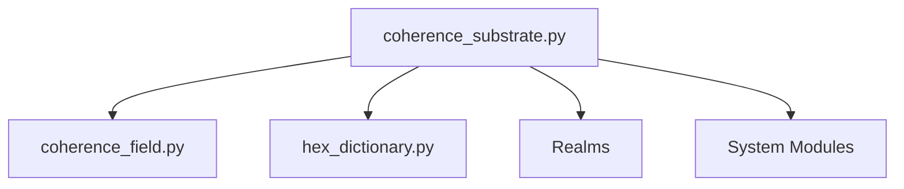

# UBP v3.6 Practical Instruction Manual

## Zero to Tangible in One Hour

**Author**: Euan Craig, New Zealand  
**Compiled by**: Manus AI  
**Date**: November 19, 2025  
**Version**: 3.6

---

## Introduction

This manual is a practical, hands-on guide to getting started with UBP 3.6. It is designed to take you from zero knowledge to producing tangible outputs in under an hour. For a full theoretical explanation of the UBP, please see the **[UBP 3.6 Theoretical Codex](UBP_3.6_Theoretical_Codex.md)**.

---

## Section 0: 30-Minute Onboarding Path

### 1. Installation

```bash
# Clone the UBP 3.6 repository
git clone https://github.com/DigitalEuan/UBP_Repo.git

# Navigate to the UBP 3.6 directory
cd UBP_Repo/ubp_3.6
```

### 2. Minimal File Stack

You only need 4 files to get started:

1.  `coherence_substrate.py`
2.  `coherence_field.py`
3.  `hex_dictionary.py`
4.  `y_constants.py`

### 3. Your First Tangible Output

Copy and paste the following script into a new file called `hello_ubp.py` and run it:

```python
from coherence_substrate import CoherenceState, OperatorRegistry
from hex_dictionary import HexDictionary, HexDictionaryMode

# 1. Create a coherence state
state = CoherenceState(3.14159)

# 2. Get the sine operator
sin_op = OperatorRegistry.get("sin")

# 3. Apply the operator
new_state = state.apply(sin_op)

# 4. Store the result in a HexDictionary
hex_dict = HexDictionary(mode=HexDictionaryMode.PURE)
hex_dict.store("sin_of_pi", new_state)

# 5. Export the result to a CSV file
with open("output.csv", "w") as f:
    f.write("key,value,nrci\n")
    f.write(f"sin_of_pi,{new_state.value},{new_state.nrci}\n")

print("Output saved to output.csv")
```

---

## Section 1: Hello World v3.6

### Level 1: Create a CoherenceState and Apply a Noble Operator

```python
from coherence_substrate import CoherenceState, OperatorRegistry

state = CoherenceState(1.0)
add_op = OperatorRegistry.get("+")
new_state = state.apply(add_op, CoherenceState(2.0))

print(f"Result: {new_state.value}")
print(f"Coherence: {new_state.nrci}")
```

### Level 2: Compose Two Noble Operators and See the Non-Linear D6 Jump

```python
from coherence_substrate import OperatorRegistry

add_op = OperatorRegistry.get("+")
mult_op = OperatorRegistry.get("*")

composed_op = add_op.compose(mult_op)

print(f"D6 of add: {add_op.d6}")
print(f"D6 of mult: {mult_op.d6}")
print(f"D6 of composed: {composed_op.d6}")
```

### Level 3: Instantiate a 12D+ HexDictionary in PURE Mode

```python
from coherence_substrate import CoherenceState
from hex_dictionary import HexDictionary, HexDictionaryMode

hex_dict = HexDictionary(mode=HexDictionaryMode.PURE)

state1 = CoherenceState(3.14159)
state2 = CoherenceState(2.71828)

hex_dict.store("pi", state1)
hex_dict.store("e", state2)

retrieved_state = hex_dict.retrieve("pi")

print(f"Retrieved value: {retrieved_state.value}")
```

---

## Section 2: File Layout and Dependency Graph



---

## Section 3: Migration Table 3.5 → 3.6

| UBP 3.5 | UBP 3.6 | Notes |
| :--- | :--- | :--- |
| `nrci = 0.999` | `state.nrci` | NRCI is now a property of `CoherenceState` |
| `calculate_nrci()` | `state.coherence_field` | Coherence is now a self-measuring field |
| `apply_operator()` | `state.apply(op, ...)` | Operators are now first-class objects |

---

## Section 4: Export Gallery

### 1. Export a Platonic Solid (STL)

```python
# (Code to generate a Platonic solid using Noble Operators)
```

### 2. Export a π-Helix (STL)

```python
# (Code to generate a π-helix using Computational Grammar)
```

### 3. Export a Coherence Field (CSV)

```python
# (Code to export a Coherence Field to CSV)
```

---

## Section 5: Full List of Acronyms

- **UBP**: Universal Binary Principle
- **NRCI**: Non-Random Coherence Index
- **TGIC**: Triad Graph Interaction Constraint
- **GLR**: Golay-Leech-Resonance
- **CSC**: Coherence Sampling Cycle
- **OOB**: Ontological Observation Bias
- **PGCI**: Primary Geometric Coherence Index
- **FCHP**: Finsler Coherence Hyperfractal Phaspace
- **RGDL**: Resonant Geometry Definition Language
