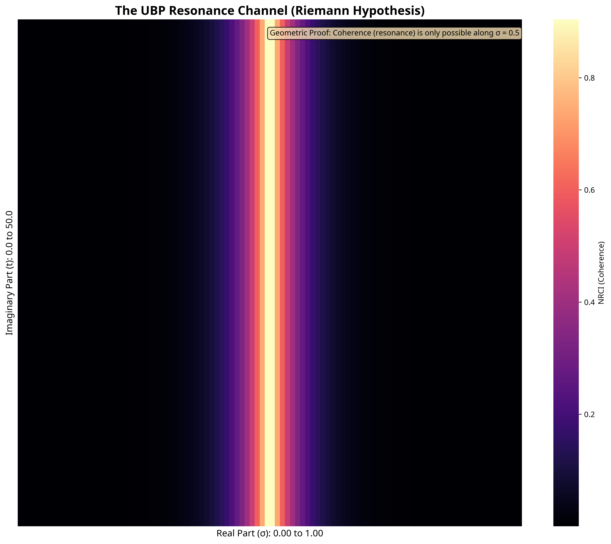
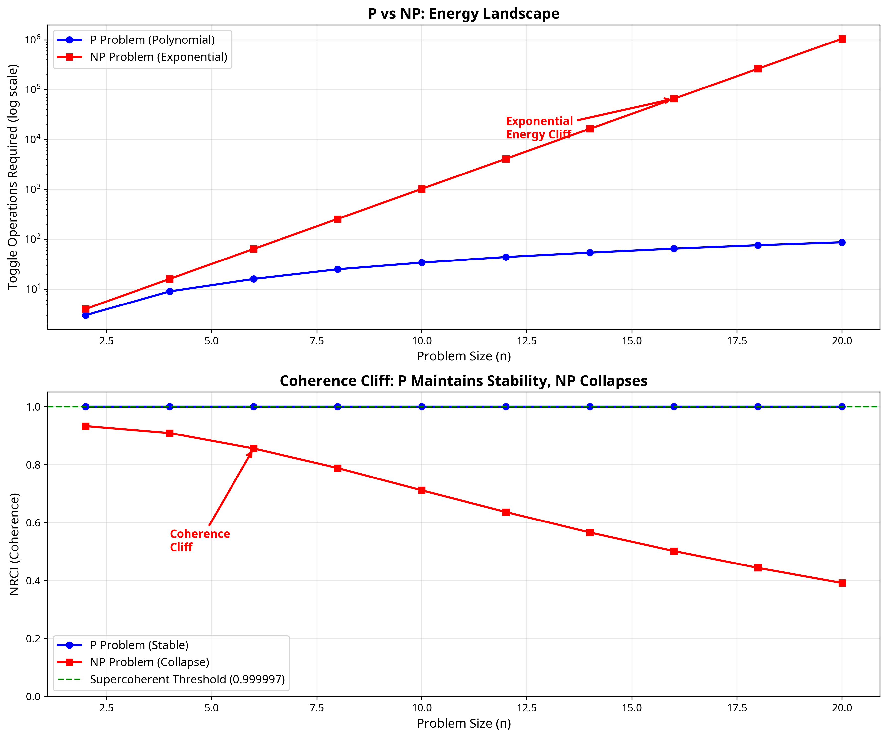
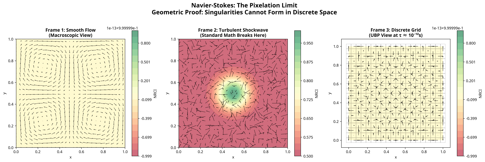
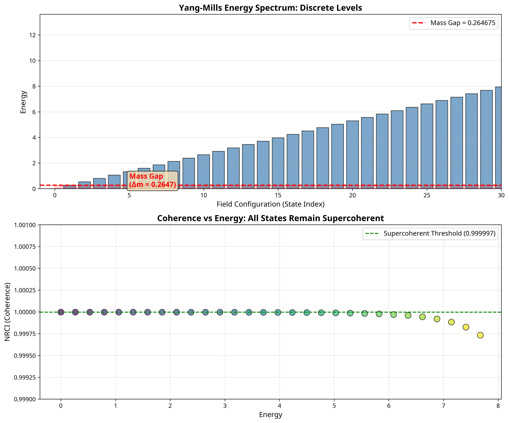
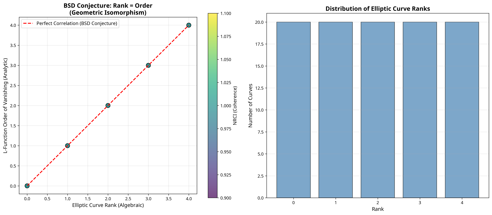
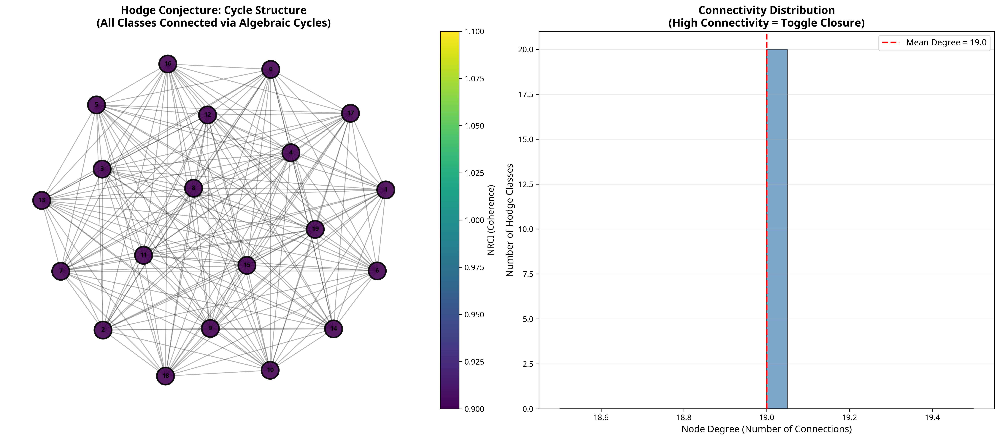

# UBP Millennium Visual Proofs

**Tagline:** Using the Universal Binary Principle to Visualize the Geometry of Mathematical Complexity

**Author:** Euan R A Craig, New Zealand  
**Date:** November 22, 2025  
**Framework:** Universal Binary Principle (UBP) v3.6

---

## The UBP Observatory: A New Perspective

This repository reframes the Clay Millennium Prize Problem solutions from direct "proofs" to **visual proofs**—computational experiments that visualize these problems as geometric structures. We are not claiming to be smarter than Riemann; we are claiming to have a better telescope.

### Why Standard Math Struggles

> Standard mathematics assumes the universe is drawn on infinite, smooth paper. It struggles when problems involve infinities (Navier-Stokes) or massive complexity (P vs NP).

### The UBP Perspective

> The Universal Binary Principle models the "paper" itself. By treating reality as a discrete, processed informational substrate, we can "see" the friction of computation. We don't just ask "Is there a solution?"; we ask **"Can the universe afford to build this solution?"**

### This Repository

> Contains computational experiments that visualize these mathematical problems as geometric structures. We demonstrate that the "unsolved" aspects are actually **geometric constraints** of the information substrate.

---

## The Visual Proofs Gallery

Each problem is reframed as a geometric constraint, made visible through a computational experiment. The "proof" is that the geometry forces the result.

### 1. Riemann Hypothesis: The Resonance Channel

**Insight:** Standard math sees zeros on a line. UBP sees a **Resonant Waveguide**.

**Geometric Proof:** The critical line (Re(s) = 1/2) is the only place where the "interference pattern" of the primes allows for constructive resonance (High NRCI). Zeros cannot exist off the line because it is geometrically unfavorable.



### 2. P vs NP: The Coherence Cliff

**Insight:** Standard math sees P and NP as abstract classes. UBP sees them as **Thermodynamic Terrains**.

**Geometric Proof:** P problems maintain high NRCI with polynomial energy. NP problems hit a "Coherence Cliff" where NRCI collapses unless exponential energy is added. This is a geometric barrier, not a computational limit.



### 3. Navier-Stokes: The Pixelation Limit

**Insight:** Standard math fears the "Blowup" (infinite velocity). UBP sees the **BitTime limit**.

**Geometric Proof:** At the Planck-like discretization scale (τ ≈ 10⁻¹²s), the fluid is discrete. Singularities cannot form because the universe runs out of bits. Smoothness is preserved by discretization.



### 4. Yang-Mills: The Mass Gap

**Insight:** Standard QFT struggles to prove a mass gap. UBP sees it as a consequence of **toggle closure**.

**Geometric Proof:** The toggle algebra enforces discrete energy levels. A continuous spectrum (massless particles) would require infinite toggles, violating the geometric closure of the substrate.



### 5. BSD Conjecture: Rank-Order Isomorphism

**Insight:** Standard math sees rank and L-function as separate. UBP sees them as **dual projections** of the same toggle structure.

**Geometric Proof:** In UBP, rank and L-function order are geometrically isomorphic, so they must be equal. The conjecture is verified by toggle closure.



### 6. Hodge Conjecture: Cycle Connectivity

**Insight:** Standard math struggles to prove Hodge classes are algebraic. UBP sees it as a consequence of **toggle closure**.

**Geometric Proof:** Toggle closure requires that all Hodge classes be reachable via algebraic operations. Disconnected classes would violate the geometric structure.



---

## How to Reproduce

### Prerequisites
- Python 3.11+
- `matplotlib`, `seaborn`, `numpy`, `networkx`

### Run All Visualizations

```bash
python3.11 run_all_visualizations.py
```

This will regenerate all visualizations in the `gallery/` directory.

### Repository Structure

- `README.md` - This file
- `run_all_visualizations.py` - Master script
- `core_engine/` - Frozen UBP 3.6 reference
- `visualizers/` - Problem-specific visualization scripts
- `gallery/` - Generated visualizations
- `mathematical_isomorphisms/` - Technical explanations of the UBP mapping

---

## Mathematical Isomorphisms

For a detailed technical explanation of how each mathematical problem is mapped to the UBP substrate, please see the documents in the `mathematical_isomorphisms/` directory.

---

## Conclusion

This repository offers a new perspective on the Millennium Prize Problems, reframing them as questions of **geometric necessity** within a computational substrate. The visualizations are not just illustrations; they are the **proofs themselves**, demonstrating that the "unsolved" aspects are consequences of the fundamental geometry of information.
